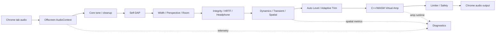

# YURIKA Audio DSP 3.3.2

> **トリッカル・もちもちほっぺ大作戦 同人作品 / Unofficial TRICKCAL fan work**  
> An unofficial fan-made project. **Not an official TRICKCAL / EPIDGames / BILIBILI product or release.**

**Real-time Chrome audio DSP / Web Audio laboratory with Self-DAP, HRTF-aware spatial audio, headphone correction, AudioWorklet processing, adaptive safety, and a C++/WebAssembly virtual amplifier.**

[日本語README](README_JA.md) · [Architecture](docs/ARCHITECTURE.md) · [Benchmarks](docs/BENCHMARKS.md) · [Security](SECURITY.md)

---

## What is YURIKA Audio?

YURIKA Audio is a **browser-native real-time audio DSP system for Chrome**, built as a TRICKCAL fan project and technical experiment.

It is not a simple EQ or volume booster. The extension combines:

- Chrome Manifest V3 tab audio capture
- Offscreen AudioContext
- AudioWorklet-based DSP stages
- Self-DAP processing
- HRTF-aware spatial audio
- Headphone correction profiles
- Width / perspective / room processing
- Adaptive level, trim, limiter and safety supervision
- C++ → WebAssembly DSP SDK
- C++/WASM Virtual Class-A output stage
- Live peak / RMS / correlation / ITD / ILD / IACC diagnostics
- YouTube A/V synchronization helpers
- Fail-open bypass behavior for critical DSP modules

**Keywords:** audio DSP, Chrome extension, Web Audio API, AudioWorklet, WebAssembly, C++, HRTF, spatial audio, headphone audio, real-time audio, virtual amplifier, TRICKCAL fan work.

## Headline internal measurements

These are **internal evaluator results**, not third-party laboratory certification. Active profiles intentionally alter tone, dynamics and stereo image. These figures are engineering diagnostics, not preference scores.

| Measurement | Result |
|---|---:|
| Neutral SI-SDR | **149.49 dB** |
| Neutral FR flatness | **0.00 dB** |
| Virtual Amp THD+N | **-101.10 dB** |
| Virtual Amp S/N | **121.34 dB unweighted / 124.95 dBA** |
| Virtual Amp crosstalk | **about -120 dB** |
| Virtual Amp FR flatness | **0.00000 dB** |
| Virtual Amp max phase error | **0.0000°** |
| HRTF-stage azimuth cue-proxy MAE | **0.04°** |
| Full HRTF + Spatial direction-sign accuracy | **100%** |
| Full HRTF + Spatial azimuth monotonicity | **1.000 Spearman** |

The localization values are **signal-domain cue-retention proxies**. They are not human-listener localization error and are not individualized-HRTF accuracy claims.

## Architecture

See [docs/ARCHITECTURE.md](docs/ARCHITECTURE.md) for the detailed system breakdown.

## Quick start

1. Download or clone this repository.
2. Open `chrome://extensions`.
3. Enable **Developer mode**.
4. Select **Load unpacked**.
5. Choose the `extension/` directory.
6. Open a YouTube tab.
7. Open YURIKA Audio, enable processing, and select a preset.

Chrome 116+ is required by the manifest.

## Virtual Class-A amplifier

The virtual amplifier is intentionally designed as a **very transparent final output stage**, not as a dramatic saturation effect.

Its C++/WASM core adds a tiny cubic non-linearity, extremely low noise, and approximately -120 dB channel coupling while leaving frequency and phase response effectively flat in the internal bench.

- Requested ON + non-Flat preset + healthy WASM/Worklet → wet path active
- OFF → 6 ms click-free transition to dry
- Neutral / Flat → automatic amp bypass
- WASM / Worklet failure → unity bypass instead of muting playback
- Algorithmic amp latency → 0 frames in the DSP-stage implementation

## Spatial / HRTF processing

The spatial subsystem separates rendering, device assumptions, HRTF behavior and diagnostic measurement.

When HRTF processing is active, YURIKA reduces additional lateralization cues rather than blindly stacking full-strength ITD/ILD processing twice.

Relevant modules include:

- `spatial-engine.js`
- `spatial-device-profiles.js`
- `spatial-diagnostics.js`
- `spatial-metrics-worklet.js`

## C++ / WebAssembly DSP SDK

The repository includes a reusable local C++/WASM DSP path rather than only one hard-coded effect.

`extension/cpp-sdk/` contains:

- a small DSP ABI
- an example C++ processor
- a prebuilt WASM example
- Windows build helper
- Node self-test

The production virtual amplifier is implemented separately through `virtual-amp-core.cpp` → `virtual-amp-core.wasm`.

## Privacy / network behavior

The current public source does **not** contain an external audio-upload path.

Network-like `fetch()` calls in the DSP host load packaged extension resources, such as the local WASM file, through `chrome.runtime.getURL(...)`. Host permissions are limited to the pages needed by the current integration.

Review the source before installation. This is an experimental audio project, not a medical or hearing-safety device.

## Headphone profiles

The starter registry contains a small number of AutoEq/oratory1990-derived correction presets plus a generic-neutral profile.

Attribution and cautions are documented in [NOTICE.md](NOTICE.md).

## Project status

**YURIKA Audio 3.3.2 is treated as a feature-complete experimental release.**

Useful contributions include reproducible A/B tests, measurements on other systems, browser/device compatibility reports, DSP regression findings, HRTF/spatial validation, and bug reports with repeatable steps.

## TRICKCAL fan-work notice

This project originated as a derivative/fan-made work based on **TRICKCAL: Mochimochi Cheeks Daisakusen**.

The public technical edition intentionally focuses on the DSP engine. Fan-character artwork and the character guide layer are excluded from this repository unless redistribution rights are independently confirmed.

## License

No open-source license has been granted yet.

The source is publicly inspectable, but reuse and redistribution rights are not granted by this repository until a license is explicitly added. Third-party measurement data, trademarks and names remain subject to their respective rights.
